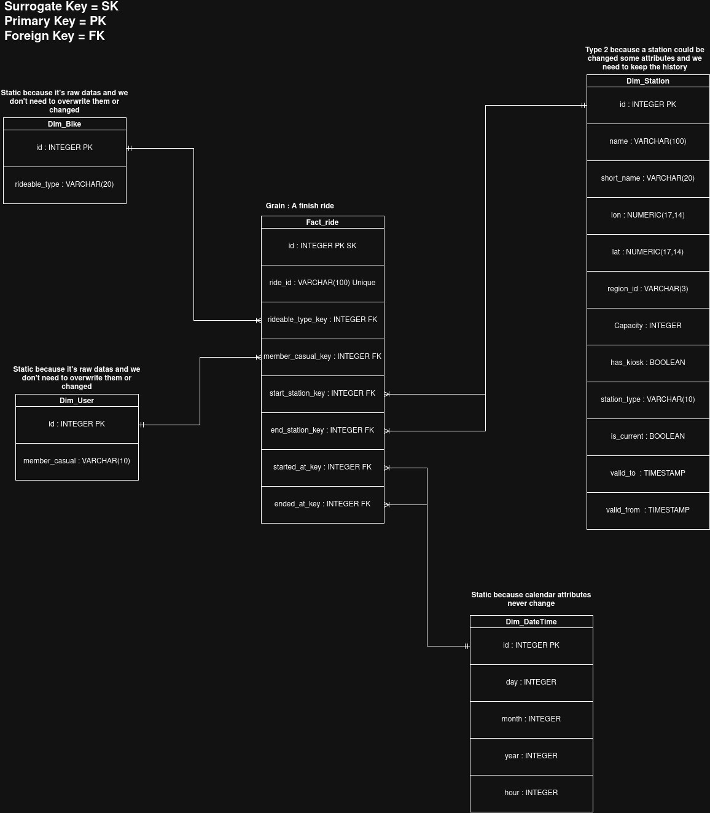

# Citi Bike Station Utilization Analysis

## Objective
The objective of this project is to identify which Citi Bike stations in New York City are over- or under-used relative to their capacity, so the operations team can better plan bike rebalancing and improve system efficiency.

## Stakeholders
- Citi Bike Operations & Fleet Rebalancing Team
- NYC Department of Transportation (DOT) urban planners

## Key Metrics (KPIs)

- Station Turnover Rate: Ratio of total bike movements relative to total dock capacity, measuring station utilization intensity.
- Net Flow Imbalance: Difference between arrivals and departures during peak windows to detect stations that are depleting or overflowing.
- E-bike Share of Departures (%): Percentage of departures made by electric bikes at each station.

## Business Questions
1. Which stations have the most departures per dock on days 1–5?
2. When are stations busiest by hour, on weekdays and weekends?
3. Which stations lose bikes in the morning or gain bikes in the evening?
4. Which 10 stations have the largest net outflow in the morning?
5. Where does net inflow exceed 90% of dock capacity on days 1–5 in the evening?
6. How do bike types differ in departures per dock and the share of stations losing bikes?
7. Which 60 station-to-station routes have the most trips?
8. Which stations and times do members and casual riders use most?
9. How busy is each station each day and week?
10. Which stations combine high activity per dock with bike gains or losses?
11. What share of activity happens at the busiest 10% of stations?
12. Which stations have steady activity or large spikes on active days?

## Data Sets
This project uses two primary datasets.

### 1. Citi Bike Trip Records (`citibike_tripdata`)
- Source: Official Citi Bike AWS S3 repository
- File: `202609-citibike-tripdata.csv`
- Dimensions: More than 1,000,000 rows and 13 columns
- Granularity: 1 row per completed bike trip

### 2. Station Infrastructure Metadata (`station_information`)
- Source: Citi Bike GBFS API
- Dimensions: Approximately 2,100 rows and 9 attributes
- Granularity: 1 row per physical docking station

## Tools
- Docker Compose: Runs the components together
- Docker volumes: Preserves raw files and database storage
- Python + `requests`: Ingests data
- PostgreSQL + SQL: Cleans, validates, models, and analyzes data
- Airflow: Schedules and monitors monthly processing
- Matplotlib + ReportLab: Creates charts and the PDF report
- Git: Tracks scripts, SQL, and configuration files

## Data Architecture

| Stage | Tool | What happens |
| --- | --- | --- |
| 1. Data ingestion | Python | Downloads the monthly trip ZIP and fetches station information from the API. |
| 2. Raw storage | Docker volume | Saves the original ZIP and JSON files for reproducibility and reprocessing. |
| 3. Staging | Python and PostgreSQL | Loads the source records into staging tables. |
| 4. Cleaning and validation | PostgreSQL SQL | Checks duplicates, missing values, and invalid records; prepares clean data. |
| 5. Data warehouse | PostgreSQL | Loads the ride fact table and station, bike, user, and date/time dimensions. |
| 6. Analysis | PostgreSQL SQL | Calculates station activity, turnover, trip imbalance, and usage patterns. |
| 7. Reporting | Python | Creates charts and tables and generates the monthly PDF report. |

## Part 5: Data Model

This is the star schema:

